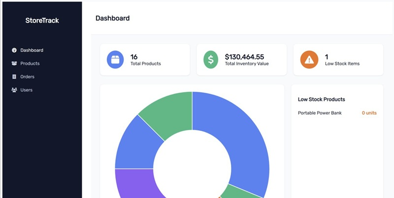
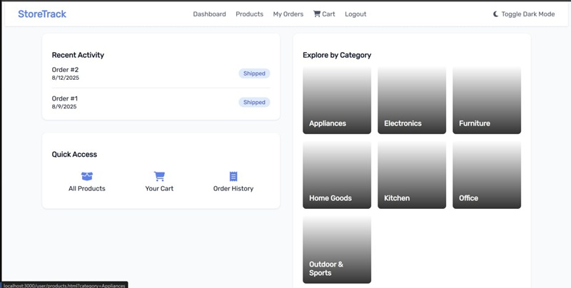
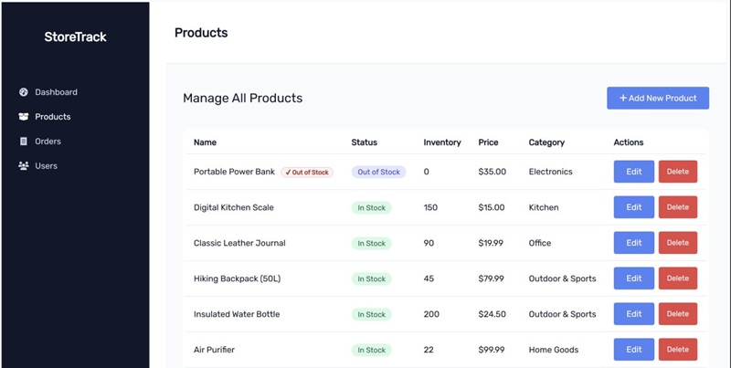
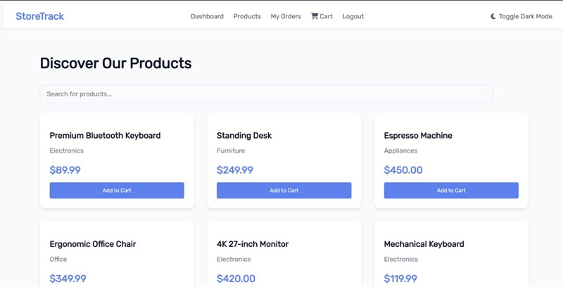
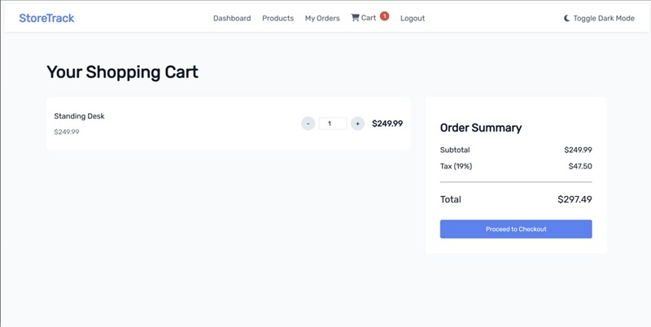

# StoreTrack 
**Inventory & Order Management System**

StoreTrack is a complete and user-friendly **inventory and order management system** built with **Node.js** for the backend and modern web technologies for the frontend.  
It is designed for small to medium-sized businesses to keep their inventory organized, track stock in real-time, manage customer orders, and generate detailed reports to support data-driven decisions.

---

## ✨ Features
- **Product Management** – Add, edit, and delete products with details such as name, category, price, and stock quantity.
- **Order Processing** – Place new orders with automatic stock deduction.
- **Stock History** – Maintain a detailed log of product check-ins and check-outs with timestamps.
- **Search & Filter** – Quickly locate specific products or orders with advanced search and filtering options.
- **Low Stock Alerts** – Receive notifications when products are running low on stock.
- **Order Status Tracking** – Monitor order lifecycle (*Pending*, *Shipped*, *Canceled*) to keep customers informed.
- **Reports & Analytics** – Generate insightful sales and inventory reports to optimize business performance.
- **Responsive UI** – Accessible and usable across different devices, including desktops, tablets, and mobile phones.
- **Dark Mode Support** – Seamlessly switch between light and dark themes for better user experience.


---

## 🛠 Tech Stack
- **Backend:** Node.js, Express.js
- **Frontend:** HTML, CSS, JavaScript (or a frontend framework if implemented)
- **Database:** MySQL (for persistent data storage)
- **Additional Tools & Libraries:** (e.g., Socket.io for real-time updates, body-parser, dotenv)

---

## 📂 Project Structure
```
StoreTrack/
│
├── backend/           # API routes, controllers, business logic
├── frontend/          # User interface, templates, styles, and scripts
├── database/          # SQL schema and initial sample data
├── public/            # Static assets such as images, CSS, and client-side JS
└── README.md
```

---

## ⚙ How It Works
1. **Admin adds products** – Details like product name, category, price, and available stock are entered.
2. **Order creation** – Customers place orders, and the system updates stock automatically.
3. **Stock movement tracking** – Every product movement (in or out) is logged for accountability.
4. **Order status updates** – Orders can be marked as pending, shipped, or canceled.
5. **Reports & alerts** – Generate inventory/sales reports and receive alerts for low stock.

---

## ▶ Running the Project

### 1. Install Dependencies
Inside the project folder, run:
```bash
npm install
```

### 2. Configure Database
- Import the provided SQL file from the `database/` folder into your MySQL server.
- Update database credentials in `.env` or the configuration file.

Example `.env` file:
```env
DB_HOST=localhost
DB_USER=root
DB_PASS=yourpassword
DB_NAME=storetrack
PORT=3000
```

### 3. Start the Server
```bash
npm start
```

### 4. Access the Application
Open your browser and navigate to:
```
http://localhost:3000
```

---

## 📸 Screenshots
> ### Dashboard
- **Admin**



- **Users**  



>### Products List
- **Admin**



- **Users**  



>### Users Cart




---

## 👨‍💻 Developers
- **Mohammad Mohajeri**  
- **Arash Barkhordarioon**  

---

## 📜 License
This project is licensed under the **MIT License**.

---
